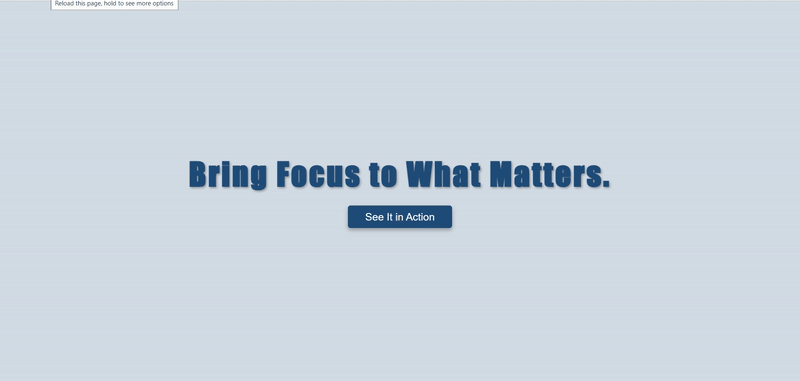
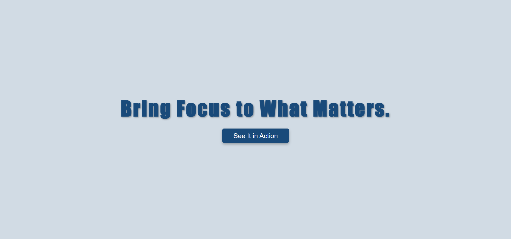
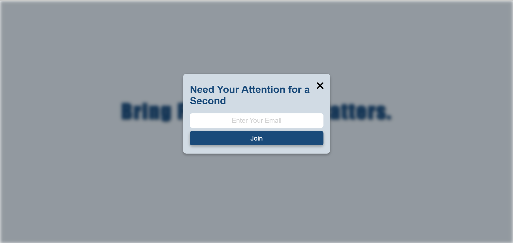

# FocusShade

**FocusShade** is a modern UI component for creating elegant, blurred background popups and modal overlays. Designed to enhance focus and minimize distractions, FocusShade brings clean, immersive user interaction to any web interface.
---

## 🚀 Profile 
<a href="https://www.linkedin.com/in/dharmendraverma95/" target="_blank">🧑‍💻 LinkedIn Profile </a> | <a href="https://www.behance.net/dhirukumar" target="_blank">🧑‍💻 Behance Profile </a>

---

## ✨ Key Features

- 🟦 **Blurred Background (Glassmorphism)** – Soft background blur effect to highlight content
- 📱 **Responsive Design** – Works seamlessly on all screen sizes
- ⚙️ **Customizable** – Easily tweak size, colors, blur level, and transitions
- ⚡ **Lightweight** – Pure HTML, CSS, and optional JavaScript (no external dependencies)
- 🔒 **Focus-Driven UX** – Keeps users centered on the task or message

---

## 📁 Project Structure

focusshade/
│
├── index.html # Demo HTML page
├── focusshade.css # Styles for modal and blur effect
├── focusshade.js # Optional JavaScript to handle open/close
└── README.md # Project documentation

🎨 Customization
You can easily update:

✨ Blur intensity (backdrop-filter)
📐 Modal width, padding, and layout
🎨 Colors and fonts
🎞️ Transition effects

👉 Desktop Design 

👉 Desktop Design 
